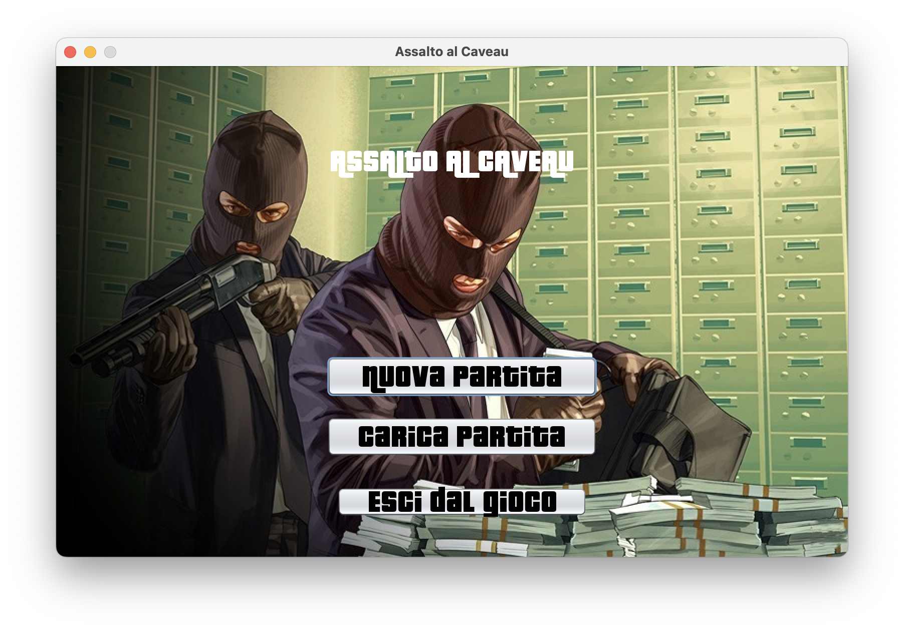
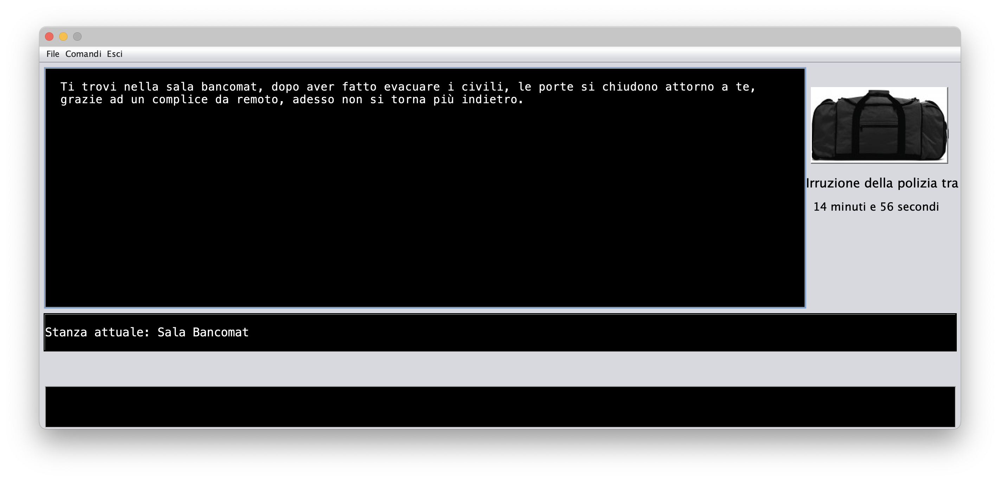
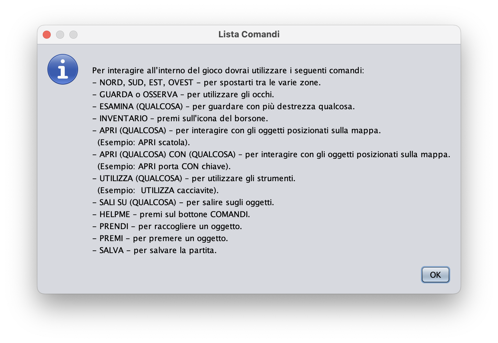
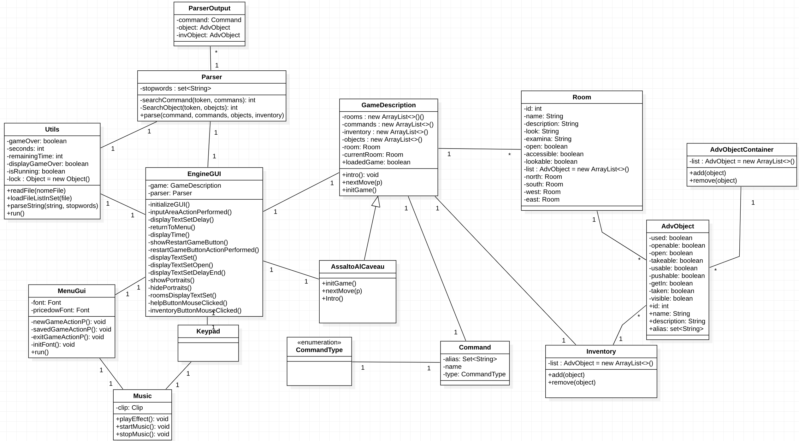
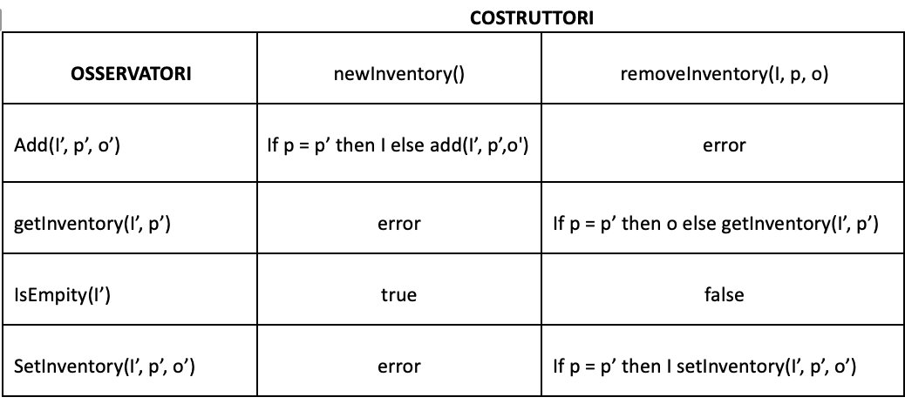
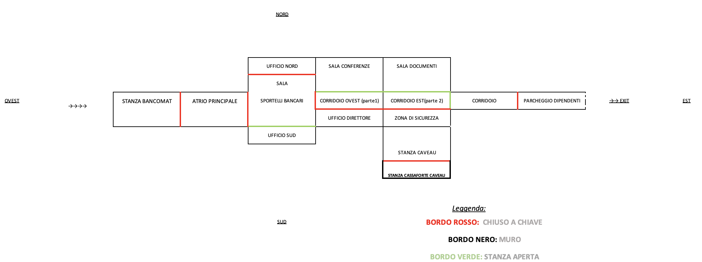

# Documentazione

## Indice
- [1. Componenti del gruppo]( #1-componenti-del-gruppo)
- [2. Descrizione caso di studio]( #2-descrizione-caso-di-studio)
- [3. Diagramma delle classi]( #3-diagramma-delle-classi)
- [4. Specifica Algebrica]( #4-specifica-algebrica)
- [5. Applicazione degli argomenti del corso]( #5-applicazione-degli-argomenti-del-corso)
- [6. Spoiler]( #6-spoiler)

## **1. Componenti del gruppo:**

-	Leonardo Montemurro
-	Lorenzo Saracino
-	Vincenzo Sarra

## **2. Descrizione caso di studio**
__________

L'avventura testuale sviluppata viene denominata Assalto Al Caveau, il gioco ha come obiettivo quello di raggiungere la stanza finale prendere il denaro e fuggire, il tutto entro un tempo stabilito.

L'ambientazione scelta è una banca, così come si può intuire dal titolo, la quale è composta da diverse stanze (segue mappa), l'utente passerà da stanza a stanza, risolvendo enigmi, aprendo porte con oggetti trovati e successivamente raccolti ed usando degli oggetti.

La difficoltà del gioco è medio/bassa, non si possono avere indizi, ed è tutto ricavabile esaminando le descrizioni degli oggetti, tuttavia abbiamo optato di scrivere una sezione **spoiler**, per rendere all'utente il gioco risolvibile nel caso in cui non fosse in grado di comprendere gli enigmi.

E' stata prevista un intro prima di inizare il gioco, per i giocatori che non leggono la descrizione dell'avventura testuale.

La partità può essere salvata, l'utente potrà riprendere a giocare dal punto salvato premendo su **carica partita** dal menu principale.

Il tempo prefisatto è stato scelto dopo vari det test del gioco e abbiamo ritenuto opportuno fissarlo a 20 minuti, questo per rendere il gameplay frenetico al punto giusto. Infatti a tal proposito sono stati introdotti degli effetti sonori che rendono percepibile all'utente ciò che sta avvenendo all'interno della banca, i suoni in questione non possono essere disattivati.

(_NB. non è possibile avviare il gioco dal terminale del proprio IDE._)

L'avventura testuale **deve essere avviata** dalla classe MenuGui, che dopo aver scelto di riprodurre o meno la musica, si presenterà così:

- Premendo su **nuova partita**, il giocatore visualizzerà la classe EngineGUI, la quale dopo aver letto la intro e aver premuto il tasto _Start_ permetterà di interagire con il gioco, avendo un Display di Output principale e una Input area disponibile per digitare i comandi.

  

E' disponibile un elenco comandi, è visibile premendo sul tasto _COMANDI_

---

## **3. Diagramma delle classi**

Il seguente diagramma rappresenta la parte di codice ralativo al funzionamento del metodo nextMove, quindi non fa riferimento alla logica di un singolo comando, ma abbiamo rappresentato la logica del gioco, ed è uno dei motivi per cui mostriamo la classe Keypad(GUI).

_(il diagramma delle classi è stato realizzato con StarUML)_

---

## **4. Specifica Algebrica**

        Inventory: elementi in sequenza il quale ogni elemento ha la sua posizione, esempio : c1,c2,...cN, gli elementi in questione sono di tipo Object.(oggetti)

        booelean = true / false

        tipi: Inventory -  poosition - boolean - object

        OPERATORI:
        - newInventory() → inventory
        - isEmpty(Inventory) → boolean
        - getInvenory(Inventory/position) → object
        - setInvenory(Inventory/position/object) → inventory
        - add(Inventory/position/object) → inventory
        - remove(Inventory/position) → inventory
        
        Costruttori di Inventory presi in considerazione:
                newInventory | remove(I,p)

      
  

        I = inventory | p = position | o = object 

---

## **5. Applicazione degli argomenti del corso**

- **File**: sono stati utilizzati per caricare dei testi, i quali sono l'intro, l'elenco dei comandi e il testo in caso di Win o GameOver, abbiamo optato per questa scelta affinchè il codice del gioco sia ordinate e non rappresenti diverse linee di codice che contengono il testo.
Inoltre è stato utilizzato il file stopwords il quale contiene tutte le parole che il parser deve ignorare.

- **JDBC**: è stato utilizzato per salvare una partita in corso e i corrispettivi progessi, successivamente il caricamento della partita può essere fatto dal menu.

- **Lambda Expression**: è stata utilizzata per la stampa ritardata del testo, in quanto è un azione che deve essere esguita ripetutatemnte da un timer con un ritardo specifico, e quando il timer scatta ad intervalli specifici la lambda expression viene eseguita, essa controllo se l'indice attuale è minore della lunghezza del tutto il testo, nel caso positivo estrare la lettera, la stampa ed incrementa l'indice di 1. Tutto ciò viene ripetuto fino al raggiungimento della lunghezza del testo e il timer viene fermato.

- **Thread**: è stato utilizzato per implementare un timer, il quale effettua un countdown, esso definisce il tempo massimo di una partita, nel caso in cui la partita termina entro il tempo stabilito, il timer viene fermato, oppure in caso di salvataggio il timer riprenderà con i minuti disponibili rimasti.

- **Swing**: utilizzato per implementare un menu iniziale che permette all'utente di iniziare una nuova partita, caricare una partita oppure uscire dal gioco. Inoltre abbiamo implementato una GUI che simula quella che è la console, la GUI in questione comprende un display che visualizza tutto ciò che viene letto dai file e la risposta del gioco dopo l'input dell'utente, per questo abbiamo previsto una InputArea dove l'utente può digitare i propri comandi. Inoltre la GUI ha un menù che comprende una munù tendina file, e il tasto comandi ed esci. Infine in questa interfaccia visualizzermo un borsone che sarà l'inventario del giocatore, il display che indica il tempo rimanente e un display che indica la stanza corrente.

_Non è stato preso in considerazione l'utilizzo del _socket_ in quanto l'idea del team è sempre stata quella di realizzare un giocatore singleplayer._

Il sistema è composta da 6 package:

- package di.uniba.map.b.adventure, contiene la classe GameDescription e Utils.
- package di.uniba.map.b.adventure.database, contiene la classe Database.
- package di.uniba.map.b.adventure.games, contiene la classe AssaltoAlCaveau.
- package di.uniba.map.b.adventure.gui, contiene le classi EngineGUI, MenuGui, Keypad, Music.
- package di.uniba.map.b.adventure.parser, contiene la classe Parser e ParserOutput;
- package di.uniba.map.b.adventure.type, contiene le classi AdvObject, AdvObjectContainer che eridata dalla precedente, Command e CommandType, infine Inventory e Room.

---

## **6. SPOILER**

**ATTENZIONE QUESTA E' UNA SEZIONE SPOILER**

Si descrivono formalmente i passaggi che devono essere svolti per superare le stanza e arrivare all'obiettivo finale.

    BancomatRoom: 

    - inventario, hai un oggetto chiamato FlipperZero.
    - apri porta con FlipperZero.
    - la stanza ad Est è sbloccata.

    Atrio Principale: 

    - usa pistola, spaventi il responsabile in questo modo ti aprira l'uffio nord.
    
    Ufficio Nord:

    - esamina scrivania.

    - premi pulsante, si apriranno dei tornelli di sicurezza, i quali sono presenti nell'atrio principale nella direzione est.

    Sala conferenze:

    - si trova a nord nella prima parte del corridoio.
    
    - Premi interruttore.

    - Esamina appendi abiti, esamina cappotto, esamina tasche.

    - Apri tasche, trovi delle chiavi, che ti serviranno ad aprire l'ufficio del direttore, si trova a sud nella prima stanza del corridoio.

    Sala Documenti:

    - Apri busta, trovi un foglio.
    
    - Prendi foglio, contiene la password per sbloccare il computer del direttore.
    
    Ufficio Direttore:

    - Esamina scrivania, ci sarà un computer sbloccabile con una password ed un post-it che dovrai prendere perchè ti servirà successivamente.

    - Usa computer, utilizza la password che hai trovato nel foglio che dovresti avere nell'inventario. (progettomap), inserendo la password si sblocca la zona di sicurezza che si trova a sud nella seconda parte del corridoio.

    - Prendi post-it, contiene una sequenza di numeri.

    SPOILER ENIGMA
    Nella seconda parte del corridoio, digitando esamina quadri, saranno visibili ed è possibile notare la direzione dello sguardo delle figure rappresentate, notanto la direzione e la sequenza dei numeri sul post-it possiamo ricavare il pin per sbloccare la cassaforte del caveau.

    CAVEAU:

    - si trova a sud della stanza di sicurezza, una volta sbloccata.

    - usa tastierino, la sequenza è 426 (LEGGI SPOILER ENIGMA).

    - sud, entri nella cassaforte caveau

    CASSAFORTE CAVEAU:

    - prendi soldi, verranno aggiunti all'inventario.

    - nord, si torna nel caveau.

    - nord, si torna nella stanza di sicurezza.

    - nord, si torna nella seconda parte del corridoio.

    CORRIODIO FINALE:

    - si trova ad est nella seconda parte del corridoio

    - esamina, c'è una porta, la quale non è apribile con nessun oggetto trovato

    - apri porta con pistola, spari la porta e la apri, è l'unica soluzione per aprirla

    PARCHEGGIO DIPENDENTI

    - si trova ad est nel corridoio finale

    - esamina furgone, visualizzi una descrizione

    - sali sul furgone, inizia la fuga e vinci.

    NOTA BENE: il gioco darà la possibilità al giocare di fuggire anche senza aver preso il denaro, perchè il corridoio finale è sempre accessibile, e la porta può sempre essere aperta perchè nell'inventario avremo sempre la pistola...e..
    ...STOP SPOILER, lasciamo scoprire questo secondo finale al giocatore.

Di seguito trovi la mappa della banca, nello spoiler non sono stati considerati oggetti e stanze che non sono essenziali per il raggiungimento della vittoria, ma servono per intrattenere il giocatore e confonderlo.

  